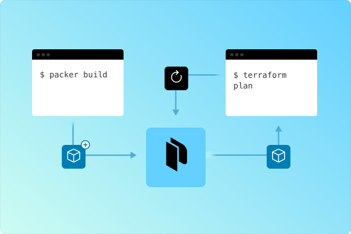

layout: true
class: img-left
background-image: url(../../assets/images/backgrounds/HashiCorp-Content-bkg.png)
background-size: cover
name: conclusion

## Streamlined Infrastructure Evolution

Allows for creation of customized images with known configurations, which can then be deployed as complete infrastructures

When integrated, Packer with Terraform are a powerful and flexible solution for infrastructure automation

Streamlines the process of provisioning and managing infrastructure, making it more efficient and reliable

